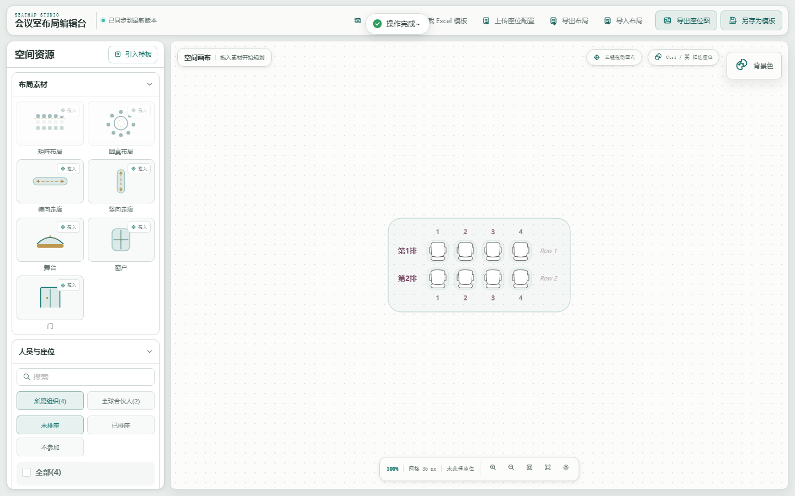

# Seatmap Studio

An open-source visual editor for meeting rooms, event seating, and space layout planning.

Seatmap Studio supports matrix layouts, round-table layouts, room elements, attendee assignment, Excel template import/export, and seatmap image export.

The app runs **standalone with zero backend**: by default all data (layouts, templates, the attendee roster) lives in your browser's IndexedDB and survives reloads. Switch storage backends at runtime via `localStorage.getItem("seatmap-api-mode")` (`"local"` IndexedDB, default · `"mock"` in-memory demo with seed data · `"remote"` a compatible API gateway). The seam lives in `src/storage/` — see [Storage Backends](#storage-backends).



## 核心功能

- 矩阵与圆桌布局，可整体拖动、增减行列或座位
- 舞台、门、窗等空间物件，可拖入、缩放和删除
- `Ctrl` / `⌘` 框选座位，支持区域配色与命名
- 人员搜索、状态筛选、拖拽入座与座位间移动
- Excel 座位模板导入、导出座位图、保存自定义模板
- 桌面与移动端自适应界面，键盘可操作主要面板和工具

## 画布操作

- 左键拖动布局或空间物件
- 鼠标中键移动画布
- 鼠标滚轮缩放画布
- `Ctrl` / `⌘` + 左键拖动框选多个座位
- 悬浮布局可打开增删、隐藏或删除工具

## 开发

```bash
pnpm install
pnpm start
```

默认开发地址：

```text
http://localhost:8080/
```

## 构建

```bash
pnpm build
```

构建产物输出到 `dist/`。

## 验证

```bash
pnpm exec tsc --noEmit
pnpm run test:e2e
pnpm run build
```

## Demo Data

By default the editor runs on the `local` (IndexedDB) backend seeded on first launch, so closures and reloads preserve your work. In the browser console, set `localStorage.setItem("seatmap-api-mode", "mock")` for an in-memory demo seeded with sample layouts, or `"remote"` to talk to a compatible remote API endpoint (see `src/storage/httpStore.ts` for the protocol and the `seatmap-api-url` / `seatmap-api-codes` / `seatmap-api-crumb` keys).

## Storage Backends

All persistence flows through a single interface, `SeatmapStore` (`src/storage/types.ts`). One thin dispatcher — `handleCpApi` in `src/api/index.ts` — routes legacy `(code, type)` calls onto semantic store methods, so UI code never touches a backend directly.

| Mode (`seatmap-api-mode`) | Backend | Persistence |
|---|---|---|
| `local` (default) | `src/storage/indexedDbStore.ts` (Dexie) | Survives reloads |
| `mock` | `src/storage/memoryStore.ts` | In-memory, reseeds on refresh |
| `remote` | `src/storage/httpStore.ts` | Your API (INVOKING_IPAAS_CID protocol) |

Both local stores share identical operation semantics via `src/storage/stateCore.ts` + `src/storage/stateStore.ts`; the full E2E suite runs against the IndexedDB default.

## Layout Import / Export

Use **导出布局 / 导入布局** in the toolbar to round-trip a layout as a `.seatmap.json` file (server schema format — the same shape returned by the storage `query` operation, so exports can double as templates). Files validate on import; the canvas is emptied before an imported layout replaces it.

## 技术栈

- React 18
- TypeScript
- Webpack 5
- Ant Design 4
- AntV X6
- Redux Toolkit
